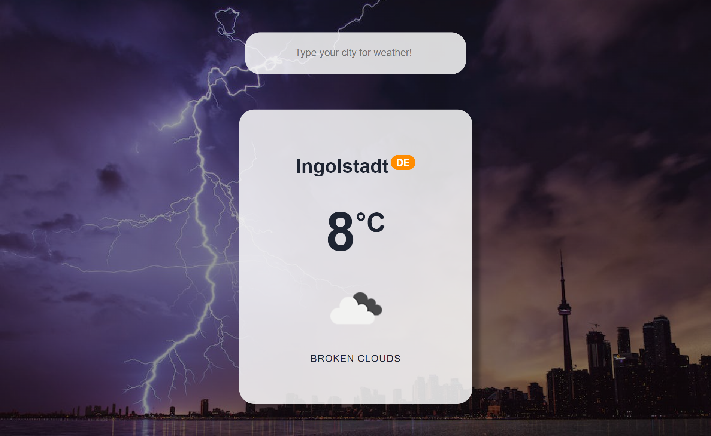
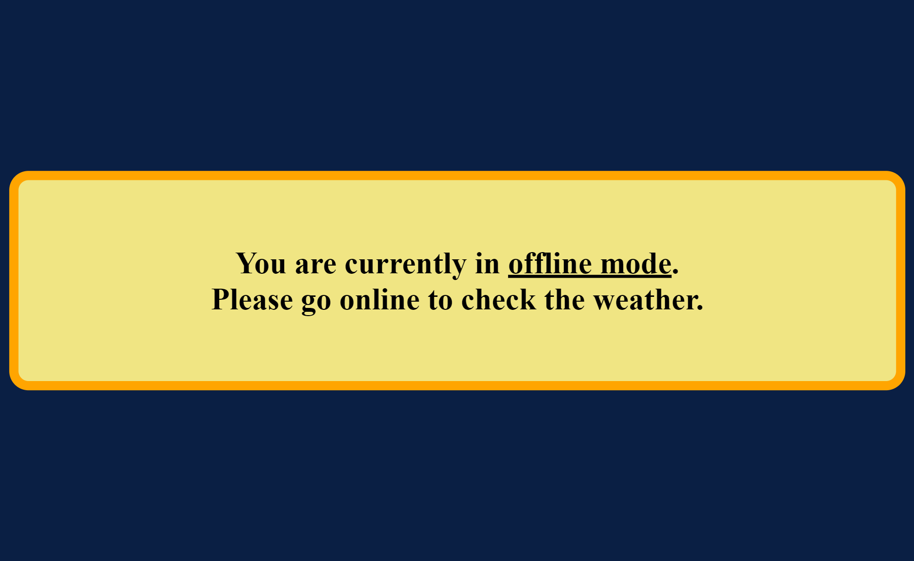
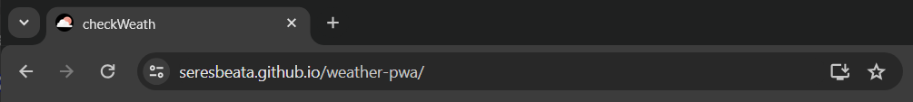
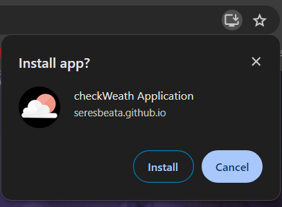
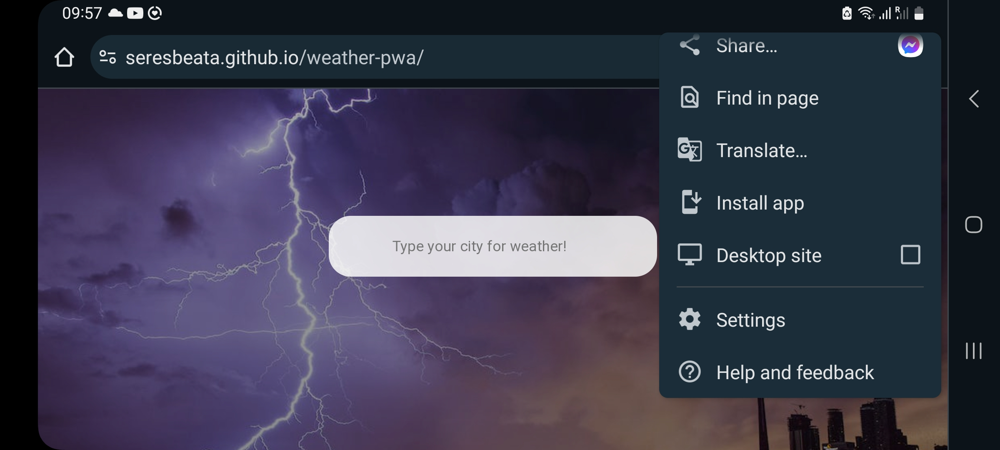
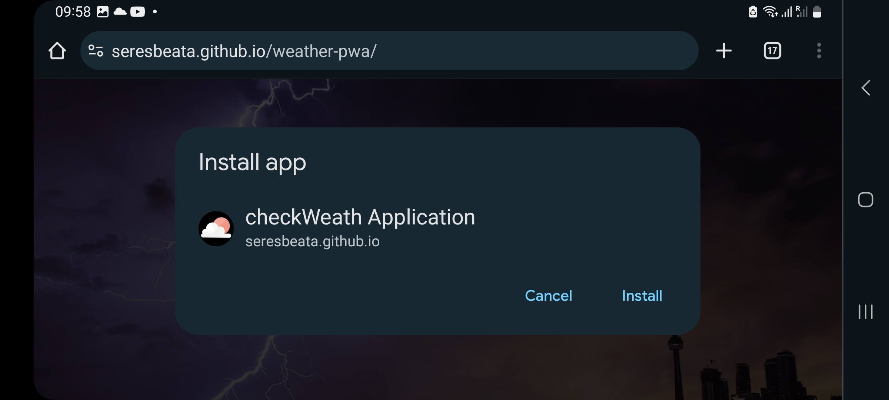

# checkWeather App

## Table of contents

- [Introduction](#introduction)
- [Screenshots to represent the project](#screenshots-to-represent-the-project)
- [Tasks in the project](#tasks-in-the-project)
- [Link to the App](#link-to-the-app)
- [Install the PWA](#install-the-pwa)
- [Features](#features)
- [To run the App in development mode](#to-run-the-app-in-development-mode)
- [Reference](#reference)

### Introduction

The aim of this project was to build a Single Page React PWA (Progressive Web Application), that loads data from an external API and enables the viewing of the weather of a searched city.

### Screenshots to represent the project

#### Online mode:

#### Offline mode:

### Tasks in the project

- Create a single page application with React by using `npx create-react-app`
- Perform an HTTP GET request in Axios for calling API - [https://openweathermap.org/api](https://openweathermap.org/api)
- Use service worker and JSON Manifest to convert the Website to Progressive Web App

### Link to the App

A link to the live, hosted version of the app: [https://seresbeata.github.io/weather-pwa/](https://seresbeata.github.io/weather-pwa/)

### Install the PWA

#### Install on desktop

1. Open Google Chrome Browser
2. Navigate to [https://seresbeata.github.io/weather-pwa/](https://seresbeata.github.io/weather-pwa/)
3. At the top right of the address bar, click Install .
4. Follow the onscreen instructions to install the PWA.

#### Install on mobile

1. On Android device, open Chrome
2. Navigate to [https://seresbeata.github.io/weather-pwa/](https://seresbeata.github.io/weather-pwa/)
3. Tap Install
4. Follow the on-screen instructions.

### Features

- Allows users to input a city name
- Returns information about the weather of the given city to the user:
  - name of the city,
  - country code,
  - temperature,
  - image that symbolizes the characteristic of the weather
  - description of the weather
- Display error message in case of invalid city name
- Displays warning message in case of offline mode

### To run the App in development mode

To run the app in the development mode, use the following terminal command in the project directory: `npm start`  
Open [http://localhost:3000](http://localhost:3000) to view it in browser.

### Reference

- Product: OpenWeatherMap
- Description: OpenWeatherMap is an online service, owned by OpenWeather Ltd, that provides global weather data via API, including current weather data, forecasts, nowcasts and historical weather data.
- Date: 03/05/2023
- Link: [https://openweathermap.org/api](https://openweathermap.org/api)
